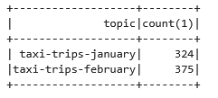
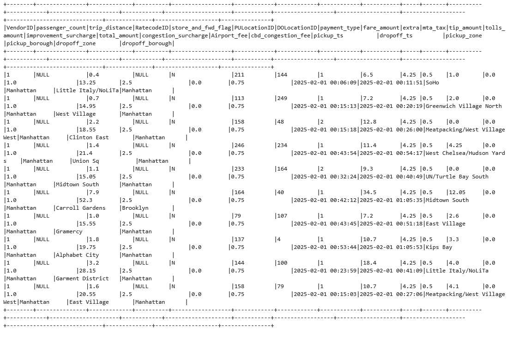
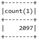
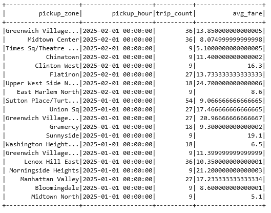
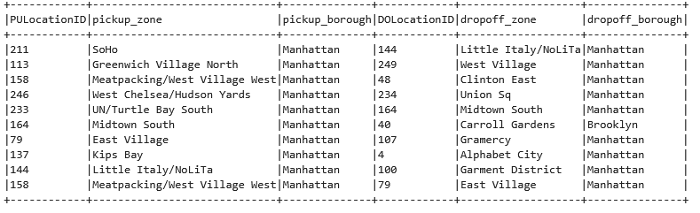
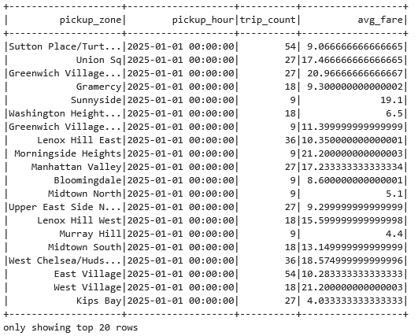
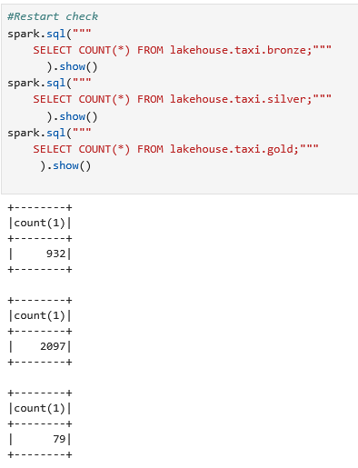
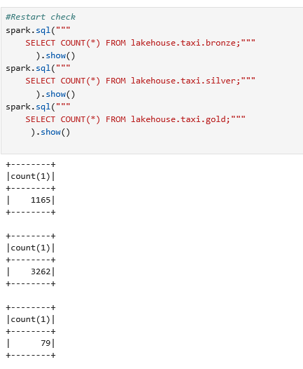

# Project 2: Streaming Lakehouse Pipeline

## 1. Medallion layer schemas

### Bronze
**Schema (Iceberg table `lakehouse.taxi.bronze`):**

    value        STRING
    kafka_time   TIMESTAMP
    topic        STRING
    partition    INT
    offset       BIGINT

**Description:**

The Bronze layer stores raw Kafka events exactly as they are received, without any transformation.

In the implementation, the Kafka stream is written directly into the Bronze table:

    bronze_df = raw_stream.selectExpr(
        "CAST(value AS STRING) AS value",
        "timestamp AS kafka_time",
        "topic",
        "partition",
        "offset"
    )

**Justification:**

- Preserves original JSON data for reprocessing and debugging  
- Retains Kafka metadata (topic, partition, offset)  
- Supports multi-topic ingestion  
- Enables replay and auditability  

SELECT topic, COUNT(*) FROM lakehouse.taxi.bronze GROUP BY topic;


---
  
### Silver

**Schema (Iceberg table `lakehouse.taxi.silver`):**

    VendorID INT
    passenger_count INT
    trip_distance DOUBLE
    RatecodeID INT
    store_and_fwd_flag STRING
    PULocationID INT
    DOLocationID INT
    payment_type INT
    fare_amount DOUBLE
    extra DOUBLE
    mta_tax DOUBLE
    tip_amount DOUBLE
    tolls_amount DOUBLE
    improvement_surcharge DOUBLE
    total_amount DOUBLE
    congestion_surcharge DOUBLE
    Airport_fee DOUBLE
    cbd_congestion_fee DOUBLE
    pickup_ts TIMESTAMP
    dropoff_ts TIMESTAMP
    pickup_zone STRING
    pickup_borough STRING
    dropoff_zone STRING
    dropoff_borough STRING

**Changes compared to Bronze:**

- JSON parsed into structured columns  
- Data types converted to numeric and timestamp formats  
- pickup_ts and dropoff_ts created  
- Invalid timestamp rows filtered  
- Data enriched with zone lookup  

**Cleaning:**

    pickup_ts IS NOT NULL AND dropoff_ts IS NOT NULL

**Enrichment:**

- Joined with taxi_zone_lookup.parquet  
- Broadcast joins used  


SELECT * FROM lakehouse.taxi.silver LIMIT 10;



SELECT COUNT(*) FROM lakehouse.taxi.silver;



---
### Gold

**Schema (Iceberg table `lakehouse.taxi.gold`):**

    pickup_zone STRING
    pickup_hour TIMESTAMP
    trip_count BIGINT
    avg_fare DOUBLE

**Aggregation logic:**

    groupBy(window(pickup_ts, "1 hour"), pickup_zone)
    -> count(*) as trip_count
    -> avg(fare_amount) as avg_fare

**Description:**

- Uses pickup_ts as event time  
- 1-hour tumbling window  
- Aggregates trips per zone  

**Note:**
Implemented as batch (not streaming).

SELECT * FROM lakehouse.taxi.gold LIMIT 20;



## 2. Cleaning rules and enrichment

Rule: Valid timestamps

    Condition:
    pickup_ts IS NOT NULL AND dropoff_ts IS NOT NULL

    Justification:
    Trips without valid pickup/dropoff times cannot be used for time-based analytics or windowing.


### Enrichment

tatic table: data/taxi_zone_lookup.parquet

Join keys:

    PULocationID → LocationID for pickup
    DOLocationID → LocationID for dropoff

Added columns:

    pickup_zone, pickup_borough
    dropoff_zone, dropoff_borough

Implementation:

    Two small dimension DataFrames (zones_pu, zones_do) with broadcast hints for efficient joins.

Justification:
Location IDs alone are not interpretable; zone and borough names make the data usable for business analysis and reporting.


Example enriched rows



## 3. Streaming configuration

_Describe:_
- _Checkpoint path and what it stores._

Checkpoint path

    Bronze: checkpoints/bronze
    Silver: checkpoints/silver
    Gold: checkpoints/gold

What it stores:

    Kafka offsets (per topic/partition) for the source.
    Progress information for each micro-batch.
    Iceberg commit metadata for the sink.

This allows exactly-once or at least no-duplicate behavior when restarting the streaming queries.
    Typical configuration:
    .trigger(processingTime="5 seconds")

Why 5 seconds:

    Small enough to keep latency low and show progress quickly in a lab setting.
    Large enough to avoid excessive overhead from too many tiny micro-batches.


    All sinks use: .outputMode("append")

Why append:

    Bronze, Silver, and Gold are append-only tables in this design.
    We are not updating or deleting existing rows, only adding new events and aggregates.
    Append mode is efficient and matches the medallion pattern for streaming ingestion.
    
### Watermark

Not implemented
    
## 4. Gold Table Partitioning

The Gold table is created using Iceberg with the following partitioning strategy:

    PARTITIONED BY (days(pickup_hour))

**Explanation:**

The `pickup_hour` column represents the start of a 1-hour aggregation window based on the trip pickup timestamp. Partitioning by `days(pickup_hour)` groups all hourly aggregates of the same day into a single partition.

**Why this choice:**

- **Optimized for time-based queries**  
  Most analytical queries focus on specific days or date ranges (e.g., daily trends, weekly comparisons). Partitioning by day allows efficient filtering.

- **Partition pruning**  
  When queries include conditions on `pickup_hour` (e.g., a date range), Iceberg can skip irrelevant partitions, reducing the amount of data scanned.

- **Balanced number of partitions**  
  Partitioning by day avoids creating too many small partitions (which would happen with hourly partitioning) while still providing good query performance.

- **Compatible with aggregation level**  
  Since the data is already aggregated at an hourly level, grouping partitions by day is a natural and efficient choice.

**Example optimized query pattern:**

    SELECT *
    FROM lakehouse.taxi.gold
    WHERE pickup_hour >= '2025-01-01'
      AND pickup_hour < '2025-01-08';




---
## 5. Restart proof - does not work fully for some reason

The idea:

    Start the Bronze, Silver, and Gold streaming queries.
    Let the producer (produce.py) run for some time.
    Check row counts:

    ```
    SELECT COUNT(*) FROM lakehouse.taxi.bronze;
    SELECT COUNT(*) FROM lakehouse.taxi.silver;
    SELECT COUNT(*) FROM lakehouse.taxi.gold;
    ```
    Stop the streaming queries (e.g., interrupt notebook cell or stop Spark).
    Restart the same streaming queries using the same checkpoint locations.
    Re-run the COUNT(*) queries.

Expected result:

    Row counts do not increase after restart if no new data was produced.
    This shows that:

        Kafka offsets were restored from the checkpoint.
        The pipeline did not reprocess already committed data.
        No duplicate rows were written to Bronze/Silver/Gold.

Raelity:
  
First run 



After restart




## 6. Custom scenario
Produce January data to topic taxi-trips-january and February data to topic taxi-trips-february (use the existing --topic and --data flags). Write a single streaming query that subscribes to both using subscribePattern("taxi-trips-.*"). In REPORT.md, show that events from both topics land in the bronze table and explain how Spark tracks offsets across multiple topics.

Two different datasets were produced to separate Kafka topics:

- January data → `taxi-trips-january`  
- February data → `taxi-trips-february`  

### Implementation

A single streaming query was configured to consume both topics using a pattern:

    .option("subscribePattern", "taxi-trips-.*")

This allows Spark to automatically subscribe to all topics matching the pattern, including both January and February streams.

---

### Proof

To verify that data from both topics is ingested into the Bronze table, the following query was executed:

    SELECT topic, COUNT(*) AS cnt
    FROM lakehouse.taxi.bronze
    GROUP BY topic;

- Output showing both topics (taxi-trips-january and taxi-trips-february)


---

### Explanation

- **Multiple topics handled in a single stream**  
  The `subscribePattern` option allows one streaming job to consume multiple Kafka topics dynamically.

- **Offsets tracked per topic-partition**  
  Spark maintains separate offsets for each `(topic, partition)` pair.

- **Checkpoint stores offset state**  
  The checkpoint directory contains the latest committed offsets for all topics and partitions.

- **Correct recovery on restart**  
  When the pipeline is restarted, Spark resumes from the last processed offsets for each topic independently.

- **No data duplication across topics**  
  Since offsets are tracked separately, events from each topic are processed exactly once (or without duplication in practice).

---
## 7. How to run


Step 1: Start infrastructure
```bash
docker compose up -d
```

Step 2. Create Kafka topics for our custom scenario (do this once after the stack is up):

```bash
docker exec kafka sh -c "/opt/kafka/bin/kafka-topics.sh --bootstrap-server localhost:9092 --create --topic taxi-trips-january --partitions 3 --replication-factor 1"

docker exec kafka sh -c "/opt/kafka/bin/kafka-topics.sh --bootstrap-server localhost:9092 --create --topic taxi-trips-february --partitions 3 --replication-factor 1"
```
Step 3. Then open a **Jupyter terminal** (File → New Terminal in JupyterLab) and run:

```bash
python project/produce.py             # 5 events/s, single pass (January data)
python project/produce.py --loop      # replay indefinitely
python project/produce.py --rate 20   # faster replay
python project/produce.py --data data/yellow_tripdata_2025-02.parquet  # February data
```
Step 4: Run the pipeline
```bash
In Jupyter (http://localhost:8888):

    Open the notebook for Project 2.

    Run cells in order:

        Spark configuration
        Bronze streaming query
        Silver streaming query
        Gold streaming query

    Optionally open Spark UI at http://localhost:4040 to monitor.

There is no extra command-line step; the pipeline is started by running the notebook cells.
```

Step 5. After finishing the project stop the stack

```bash
docker compose down          # keeps MinIO data (named volume)
docker compose down -v       # also deletes stored Iceberg tables
```

_Include the `.env` values the grader should use to run your project._
env values
```bash
MINIO_ROOT_USER=admin
MINIO_ROOT_PASSWORD=dbmgroupc
JUPYTER_TOKEN=bdm2
```
