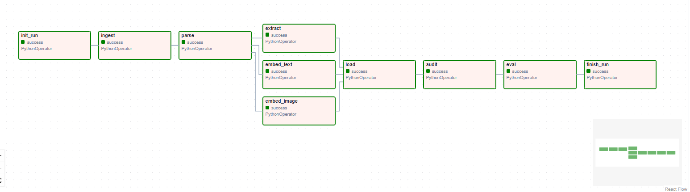
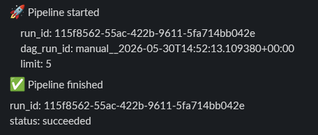
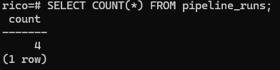
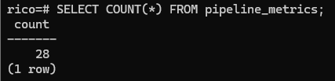
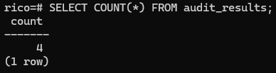
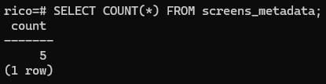
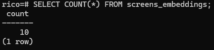
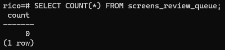

# Project 4 README
## 1. Quickstart
In order to follow our steps, do the following:
1. clone the repository
`git clone <repo-url>`
2. open Docker Desktop and Terminal
In terminal: 
- `cd ...` to the project folder
- `make up`
- `make pull-models` - this step may take some time

Access the DAG and trigger runs.

3. Open http://localhost:8080/
4. Trigger the DAG
Run the pipeline with a LIMIT parameter.
    Click the DAG → Trigger DAG
    Set LIMIT=5 for development
    Watch tasks execute in the Graph view



5. Shut everything down
Afterwards `make clean` and all the containers are removed and volumes are deleted (docker compose down -v)

## 2. Project Structure
```
Project4/
│
├── dags/
│   ├── rico_pipeline_dag.py        # Thin DAG orchestration
│   └── pipeline/                   # All business logic
│       ├── ingest.py
│       ├── parse.py
│       ├── embed.py
│       ├── extract.py
│       ├── load.py
│       ├── audit.py
│       ├── eval.py
│       ├── finish_run.py
│       ├── slack.py
│       └── utils.py
│
├── migrations/
│   └── 001_init.sql                # pipeline_runs, metrics, audit, table alters
│
├── sql/                            # (optional helper SQL)
│
├── .env
├── .gitignore
├── chosen_screens.txt
├── docker-compose.yml
├── Dockerfile
├── Makefile
└── README.md
```

## 3. Architecture

The project implements an end-to-end multimodal data pipeline for RICO mobile application screenshots.

```
RICO Dataset
↓
MinIO
↓
Ingest
↓
Parse
↓
├─ OpenCLIP (image embeddings)
├─ SBERT (text embeddings)
└─ Ollama/Qwen (LLM extraction)
↓
PostgreSQL + pgvector
↓
Audit
↓
Evaluation
↓
Slack Notifications
```

## 4. Schema Overview

Defined in migrations/001_init.sql.
Tables

pipeline_runs
 ```
Stores run-level traceability information:
- run_id
- dag_run_id
- started_at
- ended_at
- status
- model versions
- prompt version
```

screens_metadata 
 ```
Stores raw metadata, parsed text, and LLM extraction results.
Columns include:
screen_id, app_package, category, png_path, hierarchy_json_path,
extraction_payload, prompt_version, confidence, timestamps.
```

screens_embeddings
```
Stores CLIP and SBERT embeddings.
Primary key:
(screen_id, model_name, model_version, embedding_kind)
```

screens_review_queue
```
Screens that require manual review (LLM low confidence, etc).
```

audit_results
```
Stores audit execution results.
```

pipeline_metrics
```
Stores observability metrics generated during evaluation.
```

## 5. Pipeline Stages
The DAG runs:
```
init_run → ingest → parse → [embed_image, embed_text, extract] → load → audit → eval → finish_run
```
What each stage does

    init_run — creates run_id, inserts into pipeline_runs, sends Slack “run started”
    ingest — loads RICO dataset, stores PNG + JSON in MinIO, inserts metadata rows
    parse — parses view hierarchy, extracts text representation
    embed_image — CLIP embeddings (image)
    embed_text — SBERT embeddings (text)
    extract — LLM JSON extraction via Ollama
    load — writes processed data to PostgreSQL
    eval — computes observability metrics and stores them in pipeline_metrics
    eval — computes observability metrics and stores them in pipeline_metrics
    finish_run — marks run as completed and sends a Slack notification

All inserts use ON CONFLICT DO NOTHING for idempotency.


## 6. Audit (Duplicate Detection)

Audit fails the run if:
### screens_embeddings
Duplicate:
```
(screen_id, model_name, model_version, embedding_kind)
```
### screens_metadata
Duplicate:
```
screen_id
```
### If duplicates are detected:
- audit task fails
- downstream tasks are skipped
- failure is recorded in audit_results
- Slack notification is sent


## 7. Metrics (Observability)

The pipeline records the following metrics in the `pipeline_metrics` table:

- metadata_rows
- embedding_rows
- distinct_app_packages
- distinct_categories
- extraction_payload_pct
- review_queue_pct
- run_duration_sec

These metrics provide visibility into pipeline execution, data completeness, and overall processing quality.

A summary of the collected metrics is logged at the end of each pipeline run.

## 8. Notifications

Slack notifications are emitted for:

- 🚀 Pipeline started
- ✅ Pipeline finished
- ❌ Audit failed



This provides operational visibility outside Airflow.

## 9. Results

Example database state after successful execution:

- 4 pipeline runs recorded



- 28 metrics generated



- 4 audit executions completed



- 5 metadata rows loaded



- 10 embeddings generated



- 0 screens requiring manual review



### Shared Slack Workspace

For demonstration purposes, a dedicated Slack workspace was created for this project.

Workspace invite:

`https://join.slack.com/t/bdmproject/shared_invite/zt-3ziia0y6p-JkzCmCk~kVe1Pddg85~K5g`

Notifications are posted to the project channel:

`#all-bdm-project`

The following events generate notifications:

* 🚀 Pipeline started
* ✅ Pipeline finished
* ❌ Audit failed

